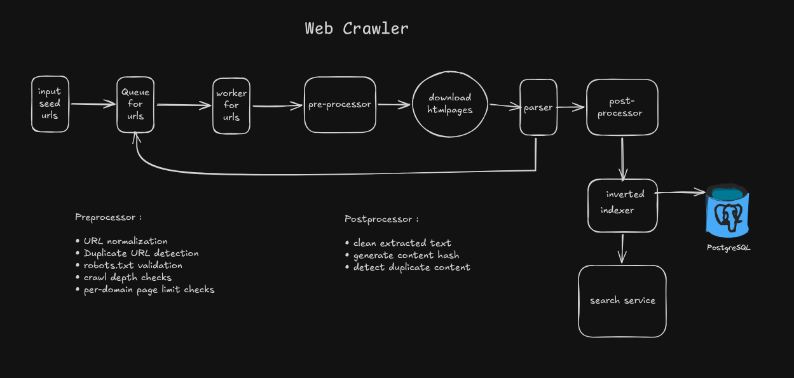

# WebCrawler

WebCrawler automatically discovers web pages, fetches content, follows links, extracts useful information, and organizes data for search.

## System Design



## Workflow (BFS Frontier)

1. Seed URLs are added to the URL queue (frontier).
2. A worker pulls one URL at a time from the queue.
3. URL pre-processors run:
   - URL normalization
   - duplicate URL checks
   - `robots.txt` validation
   - depth limit checks
   - per-domain page limit checks
4. Per-domain request-rate limiting is applied (`requestsPerSecond`).
5. The page is downloaded and parsed.
6. Post-processors clean text, generate content hash, and detect duplicate content.
7. Parsed links are converted to crawl tasks and pushed back into the URL queue for BFS traversal.
8. Processed pages and index entries are persisted in PostgreSQL.
9. Search APIs query the persisted inverted index.

## What It Does

- Crawls from one or more seed URLs
- Uses BFS traversal with a queue-based frontier
- Normalizes URLs and skips duplicates
- Validates `robots.txt`
- Applies depth and per-domain limits
- Downloads and parses HTML pages
- Cleans text, generates content hashes, and detects duplicate content
- Stores crawled pages and index data in PostgreSQL
- Builds a searchable inverted index
- Exposes crawl and search APIs

## API

### Run Crawl

`POST /api/v1/crawler/run`

Example:

```json
{
  "seedUrls": [
    "https://example.com",
    "https://example.org"
  ],
  "maxDepth": 2,
  "maxPages": 10,
  "maxPagesPerDomain": 5,
  "requestsPerSecond": 2
}
```

### Search

`GET /api/v1/search?q=example`
